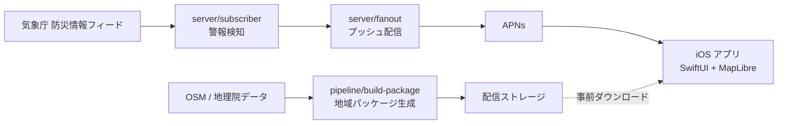

# tendenko

**津波情報をトリガーに、高台への避難を最短化する iOS アプリ。**

名前は三陸地方の伝承「津波てんでんこ」——津波が来たら各自ためらわず、即座に逃げろ——に由来します。

> **位置づけ**: tendenko は公式警報 (気象庁の津波警報・注意報) の**代替ではありません**。公式警報の**後追いで、自動的に避難準備を整える係**です。警報の受信・判断は必ず公式の情報源に従ってください。

## アーキテクチャ概要

詳細は [docs/architecture.md](docs/architecture.md) を参照してください。



- **iOS アプリ** — 地図表示とオフライン音声避難案内 (AVSpeechSynthesizer)。ネットワーク断でも動作することが最重要要件
- **server/** — 津波情報の検知 (subscriber) とプッシュ配信 (fanout)。Go 製
- **pipeline/** — 地図・道路グラフの地域パッケージを生成するバッチ。Go + GDAL/osmium
- **infra/** — OpenTofu によるインフラ定義

## 開発の始め方

開発環境の正本は `flake.nix`、実行方法の正本は `Makefile` です。

```sh
# Nix + direnv がある場合
direnv allow

# direnv を使わない場合
nix develop
```

シェルに入ったら:

```sh
make help   # 全ターゲットの一覧
make setup  # 初回セットアップ
```

Swift/Xcode は Nix で管理しません。iOS アプリのビルドには macOS + Xcode が必要です。

## ドキュメント

- [要件定義書](docs/requirements.md)
- [アーキテクチャ](docs/architecture.md)
- [ADR (アーキテクチャ決定記録)](docs/adr/) — 設計判断はすべてここに記録します
- [OSS ライセンス一覧](docs/licenses.md)

## ライセンス

本リポジトリのライセンスは**未決**です ([ADR-0002](docs/adr/0002-oss-licensing.md) 参照)。決定まで LICENSE ファイルは置きません。
