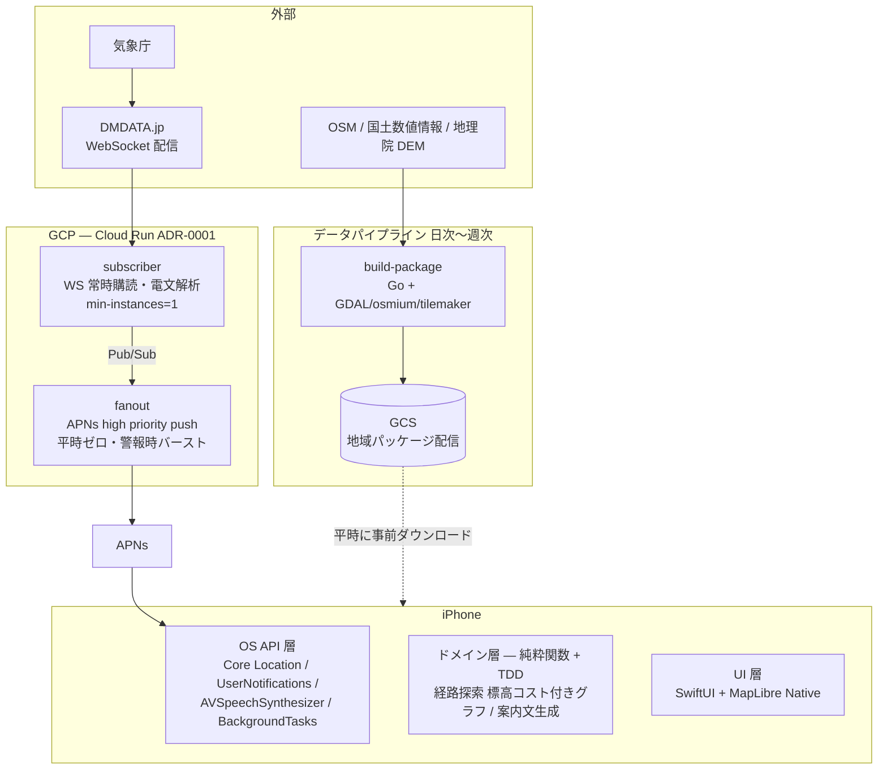

# アーキテクチャ

tendenko の全体構成。個々の決定の背景は [ADR](adr/) を参照 (実行基盤は [ADR-0001](adr/0001-execution-platform.md))。

## 全体像

## コンポーネント

### iOS アプリ (`app/` — 未生成、次セッションで立ち上げ)

- 発災時のユーザー操作ゼロが設計原則。EEW プッシュでバックグラウンド起動し、警報受信の瞬間には経路と音声案内が確定している (ウォームアップ → 案内の 2 段階、requirements.md §3.1)
- 地図・道路グラフ・避難場所・DEM は地域パッケージとして事前ダウンロードし、完全オフラインで経路計算・案内する (端末内計算 < 5 秒、NFR-03)
- ドメイン層 (経路探索・案内文生成) は純粋関数 + TDD。サーバー・インフラへの依存を持ち込まない

### server/ (Go, Cloud Run)

- `cmd/subscriber` — DMDATA.jp の WebSocket を常時購読し、EEW (VXSE43/45)・津波電文 (VTSE41/51) を解析。常時稼働 (min-instances=1)
- `cmd/fanout` — 警報時に対象地域のユーザーへ APNs high priority push を送出。受信 → 送出 p99 < 1 秒 (NFR-01)
- コードは実行基盤非依存に保つ (ADR-0001: コスト最適化時に subscriber を VM に戻す選択肢を残す)

### pipeline/ (Go + GDAL/osmium/tilemaker)

- `cmd/build-package` — OSM・浸水想定ポリゴン・指定緊急避難場所・DEM から地域パッケージ (< 150MB/地域、NFR-04) を生成し GCS へ配置
- 分割単位は **2 次メッシュ (沿岸のみ)**、道路グラフは **SQLite + 地図タイルは MBTiles** ([ADR-0003](adr/0003-region-package-format.md))

### infra/ (OpenTofu)

- ADR-0001 の Stage 1 構成を定義する。段階的スケール計画 (Stage 1 → 2 → 3) は ADR-0001 を参照

## 障害時の考え方

サーバー全損でも、端末側は ETWS (緊急速報メール) で気付いたユーザーが手動起動すれば案内できる (NFR-06)。サーバーは T1 (気付くまでの時間) を短縮する係であり、案内機能自体は端末内で完結する。
