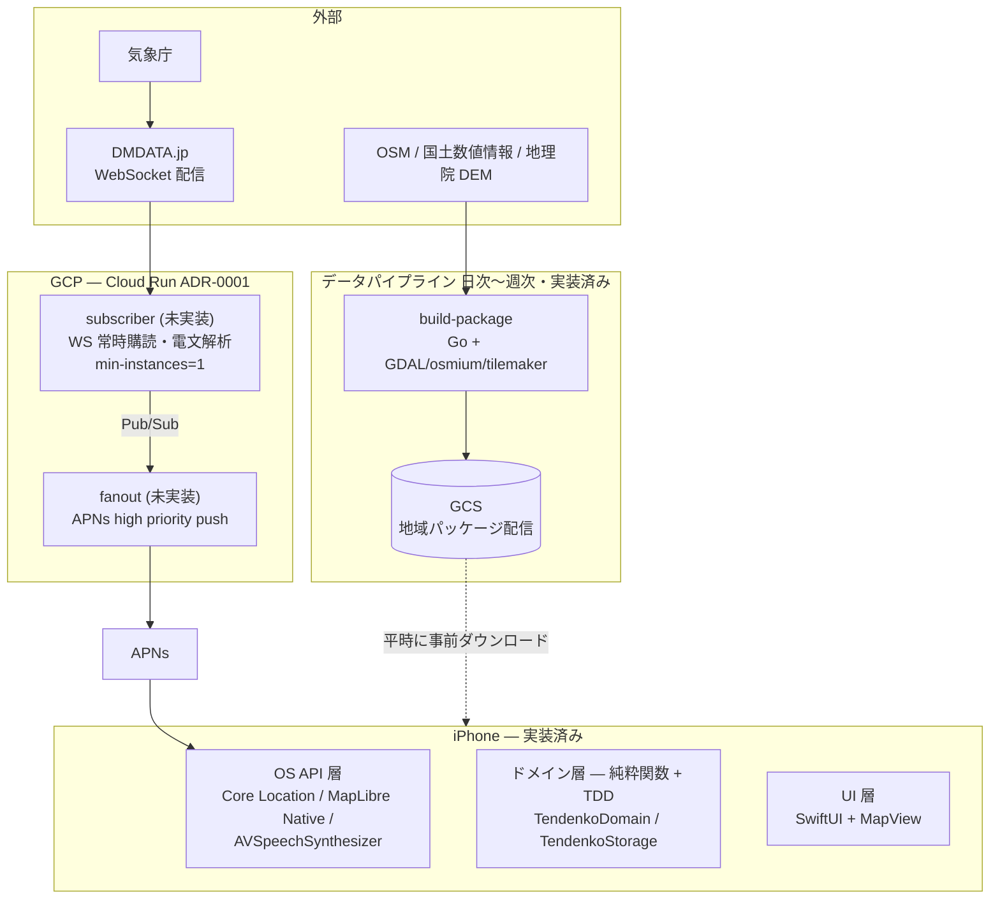

# アーキテクチャ

tendenko の全体構成・ディレクトリ索引・データモデル。個々の決定の背景・トレードオフは [ADR](adr/) を参照する (このファイルは「何がどこにあり、何をするか」の索引に徹し、決定の経緯は重複して書かない)。

## 全体像



## 実装状況 (2026-07時点)

| 領域 | 状態 |
|---|---|
| `pipeline/` | ✅ 実装済み。全国 2,515 メッシュ分のパッケージ生成を実測済み ([ADR-0003](adr/0003-region-package-format.md)) |
| `app/` (ドメイン層・UI層) | ✅ 実装済み。経路探索・地図描画・オフライン配信・地域パッケージの自動DL・音声案内 (FR-13) まで動作確認済み |
| `infra/` (OpenTofu) | ✅ 定義済み、**本番 `tofu apply` は未実行** (プロジェクトID未確定) |
| `server/` (subscriber・fanout) | ❌ **未実装**。`cmd/subscriber/main.go`・`cmd/fanout/main.go` は TODO コメントのみのスタブ |

## ディレクトリ索引

| パス | 何が置いてあるか |
|---|---|
| `app/project.yml` | Xcode プロジェクトの正本 (XcodeGen)。ターゲット・依存・ビルド設定 |
| `app/TendenkoDomain/` | ローカル Swift Package。ドメイン層 (`TendenkoDomain`) とストレージ層 (`TendenkoStorage`)。macOSでも `make domain-test` でテストできる |
| `app/Tendenko/` | UI 層 (SwiftUI + MapLibre Native)。実機・シミュレータでのみビルド可能 |
| `server/cmd/subscriber/`, `server/cmd/fanout/` | 警報検知・プッシュ配信 (未実装、スタブのみ) |
| `pipeline/cmd/build-package/` | 地域パッケージ生成バッチのエントリポイント |
| `pipeline/internal/` | パイプラインの内部パッケージ群 (下表) |
| `pipeline/scripts/` | 外部データ (A40・福井県等) を正規化 GeoJSON に変換するスクリプト群 |
| `infra/modules/tendenko/` | GCPリソース定義 (再利用モジュール、[ADR-0005](adr/0005-infra-environments.md)) |
| `infra/environments/{staging,production}/` | 環境ごとの変数・state ([ADR-0005](adr/0005-infra-environments.md)) |
| `docs/adr/` | アーキテクチャ決定記録。設計判断の背景・選択肢・トレードオフはすべてここ |
| `docs/requirements.md` | 要件定義書 (FR/NFR 番号の出典) |
| `docs/licenses.md` | 同梱・配布データの OSS/データライセンス一覧 |
| `.claude/rules/` | Claude Code 向けの領域別ルール ([CLAUDE.md](../CLAUDE.md) から参照) |

## コンポーネントの責務

### `app/` — iOS アプリ

発災時のユーザー操作ゼロが設計原則。EEW プッシュでバックグラウンド起動し、警報受信の瞬間には経路と音声案内が確定している (ウォームアップ → 案内の2段階、requirements.md §3.1)。地図・道路グラフ・避難場所・DEM は地域パッケージとして事前ダウンロードし、完全オフラインで経路計算・案内する (端末内計算 < 5秒、NFR-03)。

**ドメイン層 (`TendenkoDomain`) — サーバー・インフラ非依存の純粋関数**

| ファイル | 責務 |
|---|---|
| `MeshCode.swift` | JIS X 0410 の2次メッシュ (約10km四方)。地域パッケージの分割単位 ([ADR-0003](adr/0003-region-package-format.md)) |
| `GeoPoint.swift` | 緯度経度の点。座標を扱う純粋ロジックの共通型 |
| `RoadGraph.swift` | 道路グラフの型とエッジ属性フラグ (pipelineの`graph.Flag*`とビット割り当てを共有) |
| `EvacuationRouter.swift` | 経路探索。コストは「最短」ではなく「浸水リスク最小 + 迷いにくさ」(FR-12) |
| `RouteGeometry.swift` | 経路探索の結果を地図描画用座標に変換 |
| `GuidanceScript.swift` | 経路 → 音声案内文 (FR-13)。曲がる案内は分岐点でのみ出す ([ADR-0007](adr/0007-voice-guidance.md)) |
| `EvacuationPhase.swift` | 受信電文からアプリの状態遷移を表す型 (requirements §3.2) |
| `CachePlanner.swift` | ローリングキャッシュ (現在地 3×3 メッシュ) の保持/退避計画 ([ADR-0004](adr/0004-region-package-delivery.md)) |

**ストレージ層 (`TendenkoStorage`) — GRDB・ローカルHTTP配信**

| ファイル | 責務 |
|---|---|
| `GraphLoader.swift` | region.sqlite (複数メッシュ) を読み込み `RoadGraph` を構築 |
| `ShelterLoader.swift` | region.sqlite の `shelters` テーブルを読み込み、メッシュ境界の重複避難場所を除去 |
| `MetaLoader.swift` | region.sqlite の `meta` テーブル (帰属表示等) を読む薄い層 |
| `MBTilesReader.swift` / `MBTilesServer.swift` | MBTiles を127.0.0.1のローカルHTTPで配信 (MapLibreはネットワーク越しのタイル取得が前提のため) |
| `GlyphServer.swift` | 地名・道路名ラベル用フォントグリフをローカルHTTPで配信 ([ADR-0006](adr/0006-map-labels.md)) |
| `RegionPackageStore.swift` | 地域パッケージのローカルキャッシュ管理 ([ADR-0004](adr/0004-region-package-delivery.md)) |
| `PackageFetcher.swift` / `RegionManifest.swift` | パッケージ取得元の抽象化とGCS manifest.jsonのデコード |

**UI層 (`app/Tendenko/`) — SwiftUI**

| ファイル | 責務 |
|---|---|
| `TendenkoApp.swift` | アプリのエントリポイント |
| `ContentView.swift` | 現在地メッシュのDL・キャッシュ表示・経路オーバーレイ計算・音声案内の配線 |
| `SpeechAnnouncer.swift` | `AVAudioSession` (.playback/.voicePrompt) + `AVSpeechSynthesizer` で案内文を読み上げる ([ADR-0007](adr/0007-voice-guidance.md)) |
| `MapView.swift` / `OfflineMapStyle.swift` | MapLibre Nativeのラップとオフラインスタイル定義 (地物・ラベルのレイヤー定義) |
| `GCSPackageFetcher.swift` | 公開GCSバケットからmanifest・パッケージを取得する `PackageFetcher` の本番実装 |
| `RegionCacheCoordinator.swift` | 位置監視とキャッシュ更新の配線 (`CachePlanner`をアプリに接続) |
| `AppConfig.swift` | 実行時設定値 (`packagesBaseURL`等) |

### `server/` — 警報検知・プッシュ配信 (Go, Cloud Run, **未実装**)

| コマンド | 責務 (設計のみ、TODO) |
|---|---|
| `cmd/subscriber` | DMDATA.jpのWebSocketを常時購読し、EEW (VXSE43/45)・津波電文 (VTSE41/51) を解析。常時稼働 (min-instances=1) |
| `cmd/fanout` | 警報時に対象地域のユーザーへAPNs high priority pushを送出。受信→送出 p99 < 1秒 (NFR-01) |

実行基盤非依存に保つ ([ADR-0001](adr/0001-execution-platform.md): コスト最適化時にVMへ戻す選択肢を残す)。

### `pipeline/` — 地域パッケージ生成バッチ (Go + GDAL/osmium/tilemaker)

`cmd/build-package` がOSM・浸水想定ポリゴン・指定緊急避難場所・DEMから地域パッケージ (`region-<meshcode>.sqlite` + `tiles-<meshcode>.mbtiles`、< 150MB/地域、NFR-04) を生成しGCSへ配置する。分割単位は**2次メッシュ (沿岸のみ)** ([ADR-0003](adr/0003-region-package-format.md))。

| パッケージ | 責務 |
|---|---|
| `internal/mesh` | JIS X 0410 地域メッシュの計算 |
| `internal/osmxml` | OSM XML (.osm) のストリーミングパース |
| `internal/graph` | OSM の way から歩行者用道路グラフを構築 |
| `internal/geo` | 距離・方位の計算 |
| `internal/dem` | 地理院標高タイル (DEM10B) から標高を引く |
| `internal/inundation` | 津波浸水想定区域ポリゴンの読み込みと交差判定 (FR-12) |
| `internal/shelterdata` | 指定緊急避難場所 (災害種別: 津波) の読み込み (FR-04/FR-11) |
| `internal/pkgwriter` | `region.sqlite` の書き出し (スキーマは下記「データモデル」参照) |
| `internal/publish` | 生成済みパッケージとmanifestをGCSへアップロード ([ADR-0004](adr/0004-region-package-delivery.md)) |
| `scripts/normalize-*.sh` | 外部データ (国土数値情報A40・福井県オープンデータ等) を正規化GeoJSONへ変換する再現可能なスクリプト |

### `infra/` — OpenTofu

[ADR-0001](adr/0001-execution-platform.md) Stage 1構成 (Cloud Run jobs + Cloud Scheduler) を、[ADR-0005](adr/0005-infra-environments.md) の方針でモジュール + 環境ディレクトリに分離して定義する。

| ファイル | 責務 |
|---|---|
| `modules/tendenko/storage.tf` | 地域パッケージ配信バケット (`packages_public=true`で公開/ODbL配布、[ADR-0004](adr/0004-region-package-delivery.md)) |
| `modules/tendenko/pipeline.tf` | パイプラインの本番実行基盤 (Cloud Run job + Cloud Scheduler + Artifact Registry + SA/IAM) |
| `environments/{staging,production}/` | 環境ごとの`project_id`・バケット名・`packages_public`・`enable_schedule`のみを差し替える呼び出し側 |

段階的スケール計画 (Stage 1 → 2 → 3) は [ADR-0001](adr/0001-execution-platform.md) を参照。

## データモデル

### 地域パッケージ: `region-<meshcode>.sqlite` ([ADR-0003](adr/0003-region-package-format.md))

pipelineが書き出し (`internal/pkgwriter`)、appが読み込む (`TendenkoStorage.GraphLoader`/`ShelterLoader`/`MetaLoader`) 唯一のスキーマ。

```
meta     (key TEXT PRIMARY KEY, value TEXT NOT NULL)
nodes    (id INTEGER PRIMARY KEY, lat REAL, lon REAL, elev_m REAL)
edges    (from_id, to_id → nodes(id), length_m, grade, bearing_deg, flags INTEGER)
shelters (id INTEGER PRIMARY KEY, name TEXT, lat REAL, lon REAL, elev_m REAL)
```

- `edges` は無向グラフを1行ずつ収載 (端末ローダーが逆向きを展開: gradeの符号反転・bearing+180°)
- `flags` はビットフラグ (浸水想定区域内・階段・私道・橋 等)。pipeline側の `graph.Flag*` と app側の `RoadGraph.swift` が同じビット割り当てを共有する
- 地図タイルは同じメッシュ単位の `tiles-<meshcode>.mbtiles` (tilemaker生成、OpenMapTilesスキーマ) を別ファイルとして同梱

### 配信manifest: `manifest.json` ([ADR-0004](adr/0004-region-package-delivery.md))

GCS上でパッケージ一覧・バージョン・ハッシュ・生成日時を管理する。app側は `RegionManifest.swift` がデコードし、`CachePlanner.swift` が現在地3×3メッシュの差分DL判定に使う。

### サーバー間メッセージ (`server/`、未実装)

DMDATA.jp配信電文 → `subscriber` が解析 → Pub/Sub経由で `fanout` を起動 → APNs push、という流れを想定 (型はまだコード化されていない)。app側の受信電文表現は `EvacuationPhase.swift` に定義済み。

## 障害時の考え方

サーバー全損でも、端末側はETWS (緊急速報メール) で気付いたユーザーが手動起動すれば案内できる (NFR-06)。サーバーは T1 (気付くまでの時間) を短縮する係であり、案内機能自体は端末内で完結する。
